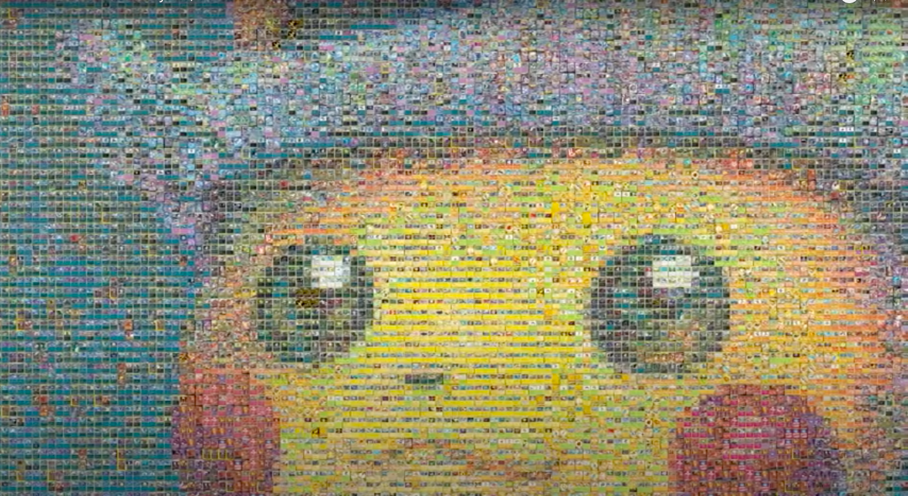
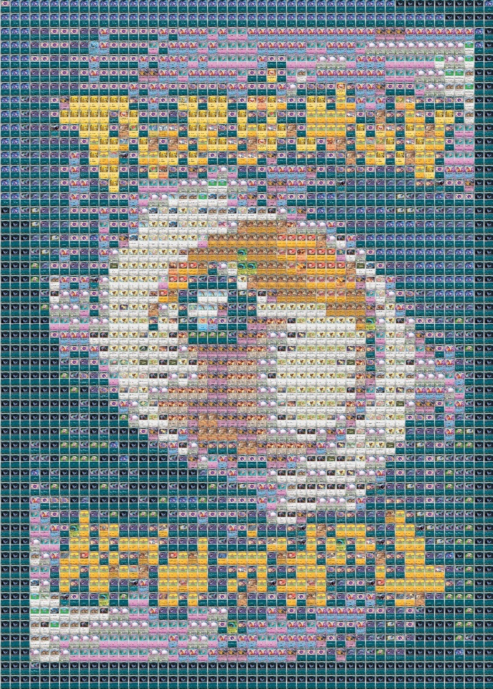
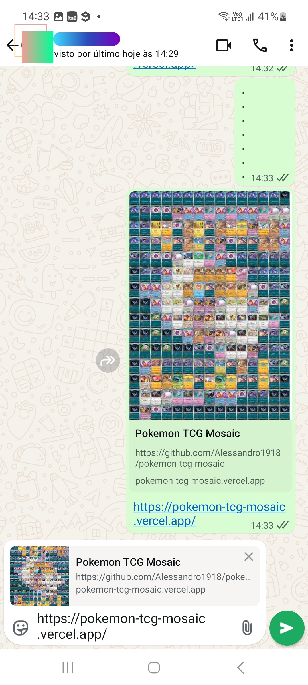
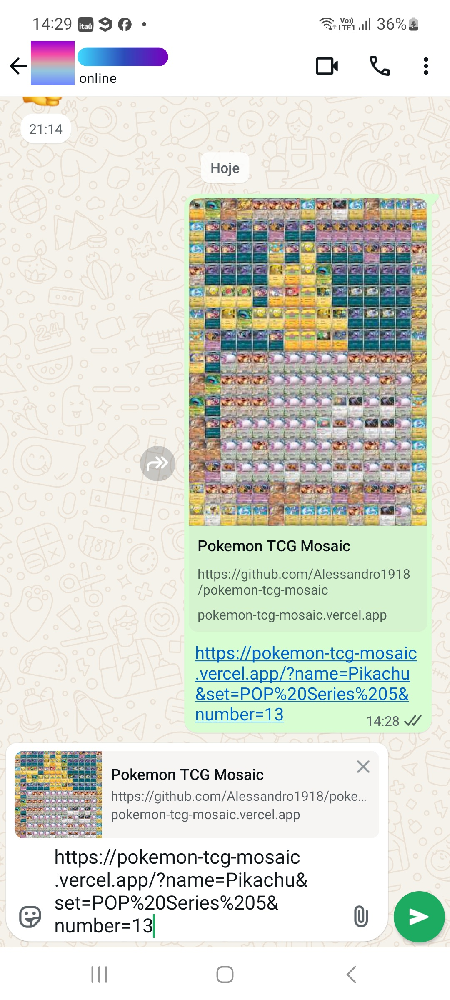

# pokemon-tcg-mosaic

## 🚀 Projeto

<div align="center">
  
</div>

</br>
Um mosaico de uma carta de Pokemon, usando outras cartas de Pokemon.

Projeto inspirado no vídeo [30,000 Pokémon Card Mosaic](https://www.youtube.com/watch?v=ZRUCJFyFWJQ).

Confira online em: https://pokemon-tcg-mosaic.vercel.app
</br></br>

<div align="center">
  
  ➡️ 
  
</div>

## 🧊 Cool features
- Geração de images client-side (pelo usuário, no [site web](https://pokemon-tcg-mosaic.vercel.app)) e server-side (dinâmicas, pela [API](https://pokemon-tcg-mosaic.vercel.app/api/og?name=Pikachu&set=POP%20Series%205&number=13)).
- Meta tags dinâmicas, para compartilhamento nas redes sociais.

<div align="center">
  
  
</div>

## 🗂️ Utilização

### 🐑🐑 Clonando o repositório:

```bash
  git clone url-do-projeto.git
```

### ▶️ Rodando o App:

#### 🖼️ Frontend

```bash
  cd pokemon-tcg-mosaic  #change to this directory
  npm install            #download dependencies to node_modules
  npm run dev            #start the project
```

Acesar pelo navegador: http://localhost:3000

Ou, confira online em: https://pokemon-tcg-mosaic.vercel.app

#### 📊 Dataset

Gerando uma lista de cores a partir de uma lista de imagens:
```bash
  cd src/app/functions                            #change to this directory
  node getAvgColorList.js ../sets/starters.json   #runs this .js script with this .json file as input 
```

Input:
```json5
//file: sets/starters.json
{
  "id": "sk",
  "name": "Starters - Kanto",
  "series": "Custom",
  "cards": [
    {
      "id": "1",
      "name": "Bulbasaur",
      "url": "https://images.pokemontcg.io/sv3pt5/1.png"
    },
    {
      "id": "4",
      "name": "Charmander",
      "url": "https://images.pokemontcg.io/sv3pt5/4.png"
    },
    {
      "id": "7",
      "name": "Squirtle",
      "url": "https://images.pokemontcg.io/sv3pt5/7.png"
    }
  ]
}
```

Output:
```json5
//file: cards/starters.json
[
  {
    "id": "1",
    "name": "Bulbasaur",
    "url": "https://images.pokemontcg.io/sv3pt5/1.png",
    "avgColor": [185,211,100]
  },
  {
    "id": "4",
    "name": "Charmander",
    "url": "https://images.pokemontcg.io/sv3pt5/4.png",
    "avgColor": [223,163,115]
  },
  {
    "id": "7",
    "name": "Squirtle",
    "url": "https://images.pokemontcg.io/sv3pt5/7.png",
    "avgColor": [136,187,214]
  }
]
```

Bulbasaur avgColor: [185,211,100] = </br>
Charmander avgColor: [223,163,115] = </br>
Squirtle avgColor: [136,187,214] = </br>


### 📋 TODO:

- ✅ Otimizar para mobile/desktop
- ✅ Controle de zoom da imagem
- ✅ Selecionar image base a partir de uma lista
- ✅ Controle de resolução da grade do mosaico (grids 25x25 até 100x100)

- ✅ Geração de meta tags dinâmicas
